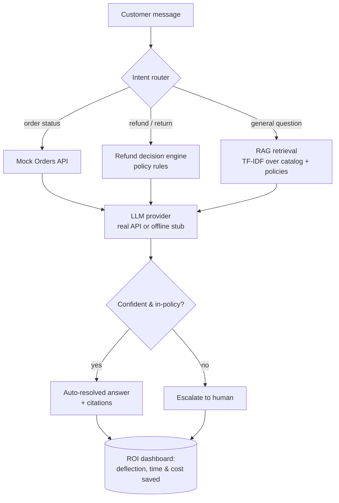

# SupportCopilot

**An AI agent that automates first-line e-commerce customer support and proves the ROI — runs end-to-end with zero paid API keys.**

[](https://github.com/LaelaZorana/ecom-support-copilot/actions/workflows/ci.yml)


## The problem

E-commerce support teams drown in repetitive tier-1 tickets — "where's my order?", "what's
your return policy?", "can I get a refund?". Each one costs an agent ~5–8 minutes and ~$0.50–$3
in loaded labour, and customers wait in a queue for answers that already exist in the catalog and
policy pages. Generic chatbots either hallucinate policy (creating refund liability) or escalate
everything (saving nothing). Teams need automation that is **grounded in their own data**, makes
**policy-correct refund decisions**, knows **when to hand off to a human**, and can **prove the
savings** to the people who sign off on it.

## What it does

SupportCopilot is a vertical support agent for an example store (Northwind Outdoors). It:

- **Answers inquiries with citations** — RAG over the store's product catalog + policy documents,
  every answer linked to the exact policy section or product it used.
- **Looks up order status** via a mock Orders API (swap in a real OMS/Shopify endpoint in one file).
- **Drafts return/refund decisions** with deterministic, unit-tested logic that respects the
  written policy (return window, final-sale, worn/used, return-shipping fee, defect → warranty).
- **Escalates to a human** when confidence is low or the situation is sensitive (defect claims,
  billing disputes, manager requests) — so it never auto-approves money it shouldn't.
- **Proves ROI** on an ops dashboard whose numbers are computed by replaying seeded tickets through
  the live agent — not hard-coded.



## Results / impact

Metrics below are produced by replaying the **20 seeded support tickets** in `data/tickets.json`
through the live agent (`make roi`). Change the policies, catalog, or ticket set and the numbers
move — they are earned, not hard-coded.

| Metric | Value |
| --- | --- |
| Tickets handled | 20 |
| **Auto-resolved (deflection rate)** | **80%** (16 / 20) |
| Escalated to human | 20% (4 / 20) — both defect claims, the billing dispute, the manager demand |
| Baseline human handle time | 7 min / ticket |
| Agent handle time saved (sample) | 1.87 h |
| Loaded agent cost | $28 / hr |
| **Projected monthly savings** | **≈ $7,840** at 3,000 tickets/mo |

At a typical mid-market volume of 3,000 tickets/month, an 80% deflection rate frees roughly
**280 agent-hours per month**. The agent's conservative escalation policy means the 20% that *do*
reach a human are the genuinely hard cases (unverified physical defects, billing/fraud, irate
customers) — exactly where human judgement adds value.

> **The vertical is swappable** — replace the knowledge base (catalog/policies) to retarget legal
> intake, real-estate lead handling, or healthcare admin. The agent, retrieval, escalation, and
> ROI machinery stay the same; only `data/` changes.

## Quickstart

Runs fully **offline** with a deterministic stub provider — **no API keys required**.

```bash
# 1. install (CPython 3.10+)
python -m venv .venv && source .venv/bin/activate
pip install -r requirements-dev.txt

# 2. run the test suite (offline, green)
make test           # or: python -m pytest -q

# 3. see the ROI report in your terminal
make roi

# 4. launch the app (prints the URL)
make demo           # -> http://localhost:8000/  (chat)  +  /dashboard  (ROI)
```

Ask it things from the command line, too:

```bash
python -m supportcopilot.cli ask "what is your return policy?"
python -m supportcopilot.cli ask "return my tent, it's unused" --order NW-1001 --email alex@example.com
```

**Using a real LLM (optional).** Install the provider extras and set a key; the app switches from
the stub automatically:

```bash
pip install -r requirements-llm.txt
export ANTHROPIC_API_KEY=sk-ant-...     # or OPENAI_API_KEY=sk-...
make demo
```

## Tech stack

- **Python 3.10+**, **FastAPI** + **Jinja2** + **htmx** — single-container web app (chat UI + dashboard), no JS build step.
- **scikit-learn TF-IDF** cosine retrieval, with a **dependency-free pure-Python fallback** so retrieval never breaks the build.
- **Provider interface** with real **Anthropic**/**OpenAI** backends and a **deterministic offline stub** — zero-key by default.
- **pytest** (49 tests: retrieval, policy/refund logic, agent routing, ROI math, web layer).
- **Docker** + **docker-compose**, **GitHub Actions** CI (tests on 3.10–3.12 + container smoke test).

## Deploy

Single container — deploy anywhere that runs a Docker image. The container needs **no secrets** to
run (it uses the offline stub); add `ANTHROPIC_API_KEY`/`OPENAI_API_KEY` to enable a real model.

**Local Docker**

```bash
make docker && make docker-run        # http://localhost:8000
# or: docker compose up --build
```

**Render / Fly.io** — point at the `Dockerfile`; the app binds `0.0.0.0:$PORT` (both platforms set
`$PORT`). On Fly: `fly launch` then `fly deploy`. On Render: new **Web Service** → Docker → no start
command needed. Set provider keys as environment variables if you want a real model.

**Hugging Face Spaces (Docker SDK)** — create a Docker Space, push this repo; Spaces sets `$PORT`
(usually 7860) and the container honours it. Add keys under *Settings → Secrets* to enable a real
provider.

## Screenshots

> _Screenshots placeholder — add `docs/chat.png` and `docs/dashboard.png`._
> Run `make demo` and open `http://localhost:8000/` (chat) and `/dashboard` (ROI) to capture them.

| Chat (grounded answers + citations) | ROI dashboard (deflection, time & cost saved) |
| --- | --- |
| _`docs/chat.png`_ | _`docs/dashboard.png`_ |
